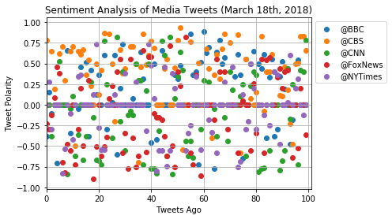
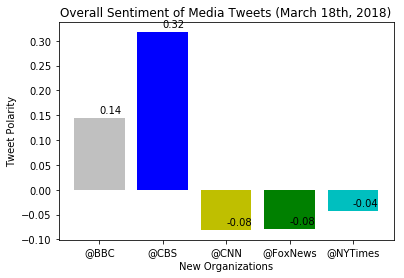

```python
import json
import pandas as pd
import numpy as np
import seaborn as sns
import matplotlib.pyplot as plt
import time
import tweepy
from datetime import datetime
from vaderSentiment.vaderSentiment import SentimentIntensityAnalyzer
analyzer = SentimentIntensityAnalyzer()
```


```python
# Twitter API Keys
consumer_key = "zVyUV4afVlhAHTrkNY1ABGicW"
consumer_secret = "mEYy1WJy4QJ0R7Rd0xRX4JMWlGW7qGwLwQYTVLGyNAb0koxCGi"
access_token = "971902934899478528-AR7XPv7HEEprU1atSUGSmGzMtcNFNe9"
access_token_secret = "ETrEsE9hNHWvpdm3S8luOzSIzDp67ZyyKKP8cqgX6BrCj"

# Setup Tweepy API Authentication
auth = tweepy.OAuthHandler(consumer_key, consumer_secret)
auth.set_access_token(access_token, access_token_secret)
api = tweepy.API(auth, parser=tweepy.parsers.JSONParser())
```


```python
sentiments = []

target_users = ("@BBC", "@CBS", "@CNN", "@FoxNews", "@NYTimes")
```


```python
for user in target_users:
    
    #Counter 
    counter = 0

    public_tweets = api.user_timeline(user, count = 100)

        

    for tweet in public_tweets:

        #Vader

        compound = analyzer.polarity_scores(tweet["text"])["compound"]
        pos = analyzer.polarity_scores(tweet["text"])["pos"]
        neu = analyzer.polarity_scores(tweet["text"])["neu"]
        neg = analyzer.polarity_scores(tweet["text"])["neg"]
        tweets_ago = counter
        tweet_text = tweet["text"]


        sentiments.append({"User" : user,
                           "Date": tweet["created_at"],
                           "Compound" : compound,
                           "Positive" : pos,
                           "Negative" : neg,
                           "Neutral" : neu,
                           "Tweets Ago" : counter,
                           "Tweet Text" : tweet_text})
        

        counter = counter + 1
```


```python
news_sentiments = pd.DataFrame.from_dict(sentiments)
news_sentiments
```


<div>
<style>
    .dataframe thead tr:only-child th {
        text-align: right;
    }

    .dataframe thead th {
        text-align: left;
    }

    .dataframe tbody tr th {
        vertical-align: top;
    }
</style>
<table border="1" class="dataframe">
  <thead>
    <tr style="text-align: right;">
      <th></th>
      <th>Compound</th>
      <th>Date</th>
      <th>Negative</th>
      <th>Neutral</th>
      <th>Positive</th>
      <th>Tweet Text</th>
      <th>Tweets Ago</th>
      <th>User</th>
    </tr>
  </thead>
  <tbody>
    <tr>
      <th>0</th>
      <td>-0.3818</td>
      <td>Mon Mar 19 19:33:04 +0000 2018</td>
      <td>0.110</td>
      <td>0.890</td>
      <td>0.000</td>
      <td>Follow the dramatic and deadly series of event...</td>
      <td>0</td>
      <td>@BBC</td>
    </tr>
    <tr>
      <th>1</th>
      <td>0.1531</td>
      <td>Mon Mar 19 18:33:05 +0000 2018</td>
      <td>0.116</td>
      <td>0.709</td>
      <td>0.175</td>
      <td>Leonardo DiCaprio stars in the true story of a...</td>
      <td>1</td>
      <td>@BBC</td>
    </tr>
    <tr>
      <th>2</th>
      <td>-0.1027</td>
      <td>Mon Mar 19 18:03:01 +0000 2018</td>
      <td>0.080</td>
      <td>0.920</td>
      <td>0.000</td>
      <td>😂📸 @AlanCarr learned the hard way that you onl...</td>
      <td>2</td>
      <td>@BBC</td>
    </tr>
    <tr>
      <th>3</th>
      <td>0.0000</td>
      <td>Mon Mar 19 17:30:08 +0000 2018</td>
      <td>0.000</td>
      <td>1.000</td>
      <td>0.000</td>
      <td>🎤Pop band @FifthHarmony have announced they're...</td>
      <td>3</td>
      <td>@BBC</td>
    </tr>
    <tr>
      <th>4</th>
      <td>-0.7096</td>
      <td>Mon Mar 19 17:00:05 +0000 2018</td>
      <td>0.414</td>
      <td>0.442</td>
      <td>0.144</td>
      <td>Murder. Innocence. Lies. \n\n@AgathaChristie c...</td>
      <td>4</td>
      <td>@BBC</td>
    </tr>
    <tr>
      <th>5</th>
      <td>0.0000</td>
      <td>Mon Mar 19 16:33:29 +0000 2018</td>
      <td>0.000</td>
      <td>1.000</td>
      <td>0.000</td>
      <td>Here are the latest snow scenes from around th...</td>
      <td>5</td>
      <td>@BBC</td>
    </tr>
    <tr>
      <th>6</th>
      <td>0.0000</td>
      <td>Mon Mar 19 15:02:02 +0000 2018</td>
      <td>0.000</td>
      <td>1.000</td>
      <td>0.000</td>
      <td>'Flabbergasted'. 🎶This is the incredible momen...</td>
      <td>6</td>
      <td>@BBC</td>
    </tr>
    <tr>
      <th>7</th>
      <td>0.0000</td>
      <td>Mon Mar 19 14:30:08 +0000 2018</td>
      <td>0.000</td>
      <td>1.000</td>
      <td>0.000</td>
      <td>Meet the dancing slum kids tipped for stardom ...</td>
      <td>7</td>
      <td>@BBC</td>
    </tr>
    <tr>
      <th>8</th>
      <td>0.6588</td>
      <td>Mon Mar 19 13:44:55 +0000 2018</td>
      <td>0.000</td>
      <td>0.788</td>
      <td>0.212</td>
      <td>RT @bbcgetinspired: The Nation's Billion Steps...</td>
      <td>8</td>
      <td>@BBC</td>
    </tr>
    <tr>
      <th>9</th>
      <td>-0.3412</td>
      <td>Mon Mar 19 13:03:04 +0000 2018</td>
      <td>0.112</td>
      <td>0.888</td>
      <td>0.000</td>
      <td>💭 "There's always that voice in the back of yo...</td>
      <td>9</td>
      <td>@BBC</td>
    </tr>
    <tr>
      <th>10</th>
      <td>0.0000</td>
      <td>Mon Mar 19 12:55:17 +0000 2018</td>
      <td>0.000</td>
      <td>1.000</td>
      <td>0.000</td>
      <td>RT @BBCRadioScot: This must have been some buz...</td>
      <td>10</td>
      <td>@BBC</td>
    </tr>
    <tr>
      <th>11</th>
      <td>0.0000</td>
      <td>Mon Mar 19 12:30:05 +0000 2018</td>
      <td>0.000</td>
      <td>1.000</td>
      <td>0.000</td>
      <td>Where are the UK's youngest and oldest city po...</td>
      <td>11</td>
      <td>@BBC</td>
    </tr>
    <tr>
      <th>12</th>
      <td>-0.0516</td>
      <td>Mon Mar 19 11:50:58 +0000 2018</td>
      <td>0.107</td>
      <td>0.893</td>
      <td>0.000</td>
      <td>RT @BBCSport: This 102-shot badminton rally wi...</td>
      <td>12</td>
      <td>@BBC</td>
    </tr>
    <tr>
      <th>13</th>
      <td>0.4588</td>
      <td>Mon Mar 19 11:33:04 +0000 2018</td>
      <td>0.000</td>
      <td>0.857</td>
      <td>0.143</td>
      <td>Have you got a passion for plants? 🌿🌸🌱🍃🌷\n\nTe...</td>
      <td>13</td>
      <td>@BBC</td>
    </tr>
    <tr>
      <th>14</th>
      <td>0.0000</td>
      <td>Mon Mar 19 10:53:19 +0000 2018</td>
      <td>0.000</td>
      <td>1.000</td>
      <td>0.000</td>
      <td>RT @BBCSport: 🎉 The Commonwealth Games are alm...</td>
      <td>14</td>
      <td>@BBC</td>
    </tr>
    <tr>
      <th>15</th>
      <td>0.5106</td>
      <td>Mon Mar 19 10:33:03 +0000 2018</td>
      <td>0.000</td>
      <td>0.837</td>
      <td>0.163</td>
      <td>The oldest dog that the Dogs Trust has ever lo...</td>
      <td>15</td>
      <td>@BBC</td>
    </tr>
    <tr>
      <th>16</th>
      <td>-0.3818</td>
      <td>Mon Mar 19 09:58:24 +0000 2018</td>
      <td>0.191</td>
      <td>0.809</td>
      <td>0.000</td>
      <td>RT @BBCR1: Desperately searching for any signs...</td>
      <td>16</td>
      <td>@BBC</td>
    </tr>
    <tr>
      <th>17</th>
      <td>0.4199</td>
      <td>Mon Mar 19 09:58:15 +0000 2018</td>
      <td>0.000</td>
      <td>0.843</td>
      <td>0.157</td>
      <td>RT @BBCRadioWales: ❄️ Snowy Cardiff! ⛄️ \n\nWh...</td>
      <td>17</td>
      <td>@BBC</td>
    </tr>
    <tr>
      <th>18</th>
      <td>0.0000</td>
      <td>Mon Mar 19 09:58:10 +0000 2018</td>
      <td>0.000</td>
      <td>1.000</td>
      <td>0.000</td>
      <td>RT @BBCNews: Stem cell transplant "game change...</td>
      <td>18</td>
      <td>@BBC</td>
    </tr>
    <tr>
      <th>19</th>
      <td>0.1280</td>
      <td>Mon Mar 19 09:57:58 +0000 2018</td>
      <td>0.079</td>
      <td>0.789</td>
      <td>0.133</td>
      <td>RT @BBCBreakfast: Anyone want to play a game o...</td>
      <td>19</td>
      <td>@BBC</td>
    </tr>
    <tr>
      <th>20</th>
      <td>0.3642</td>
      <td>Mon Mar 19 09:32:02 +0000 2018</td>
      <td>0.000</td>
      <td>0.848</td>
      <td>0.152</td>
      <td>'Who wants a normal life?' We should all be a ...</td>
      <td>20</td>
      <td>@BBC</td>
    </tr>
    <tr>
      <th>21</th>
      <td>0.0000</td>
      <td>Mon Mar 19 09:27:50 +0000 2018</td>
      <td>0.000</td>
      <td>1.000</td>
      <td>0.000</td>
      <td>RT @BBCWthrWatchers: Some incredible photos se...</td>
      <td>21</td>
      <td>@BBC</td>
    </tr>
    <tr>
      <th>22</th>
      <td>0.5994</td>
      <td>Mon Mar 19 08:45:02 +0000 2018</td>
      <td>0.000</td>
      <td>0.738</td>
      <td>0.262</td>
      <td>Beautiful spring blossom in south-west China h...</td>
      <td>22</td>
      <td>@BBC</td>
    </tr>
    <tr>
      <th>23</th>
      <td>-0.2960</td>
      <td>Mon Mar 19 08:02:00 +0000 2018</td>
      <td>0.109</td>
      <td>0.891</td>
      <td>0.000</td>
      <td>🤔 Should we still be worried about the hole in...</td>
      <td>23</td>
      <td>@BBC</td>
    </tr>
    <tr>
      <th>24</th>
      <td>0.0000</td>
      <td>Sun Mar 18 20:30:11 +0000 2018</td>
      <td>0.000</td>
      <td>1.000</td>
      <td>0.000</td>
      <td>🏃💪 @LesDennis, @SimplySusannah, @Tameka_Empson...</td>
      <td>24</td>
      <td>@BBC</td>
    </tr>
    <tr>
      <th>25</th>
      <td>0.0258</td>
      <td>Sun Mar 18 20:03:04 +0000 2018</td>
      <td>0.086</td>
      <td>0.824</td>
      <td>0.090</td>
      <td>👎💌 Fans of K-Pop boyband member @IBGDRGN have ...</td>
      <td>25</td>
      <td>@BBC</td>
    </tr>
    <tr>
      <th>26</th>
      <td>0.5994</td>
      <td>Sun Mar 18 19:33:04 +0000 2018</td>
      <td>0.000</td>
      <td>0.803</td>
      <td>0.197</td>
      <td>Saoirse Ronan stars as Eilis, a young girl who...</td>
      <td>26</td>
      <td>@BBC</td>
    </tr>
    <tr>
      <th>27</th>
      <td>-0.5994</td>
      <td>Sun Mar 18 18:44:02 +0000 2018</td>
      <td>0.163</td>
      <td>0.837</td>
      <td>0.000</td>
      <td>Ruth Ellis was only 28 when she became the las...</td>
      <td>27</td>
      <td>@BBC</td>
    </tr>
    <tr>
      <th>28</th>
      <td>0.2040</td>
      <td>Sun Mar 18 18:34:14 +0000 2018</td>
      <td>0.077</td>
      <td>0.772</td>
      <td>0.151</td>
      <td>RT @BBC_TopGear: 840bhp goes a little like thi...</td>
      <td>28</td>
      <td>@BBC</td>
    </tr>
    <tr>
      <th>29</th>
      <td>0.7331</td>
      <td>Sun Mar 18 17:18:12 +0000 2018</td>
      <td>0.000</td>
      <td>0.660</td>
      <td>0.340</td>
      <td>RT @bbcthree: Be honest, do you think you'll b...</td>
      <td>29</td>
      <td>@BBC</td>
    </tr>
    <tr>
      <th>...</th>
      <td>...</td>
      <td>...</td>
      <td>...</td>
      <td>...</td>
      <td>...</td>
      <td>...</td>
      <td>...</td>
      <td>...</td>
    </tr>
    <tr>
      <th>470</th>
      <td>0.0000</td>
      <td>Mon Mar 19 14:20:07 +0000 2018</td>
      <td>0.000</td>
      <td>1.000</td>
      <td>0.000</td>
      <td>New York’s school system is complex and deeply...</td>
      <td>70</td>
      <td>@NYTimes</td>
    </tr>
    <tr>
      <th>471</th>
      <td>0.4588</td>
      <td>Mon Mar 19 14:11:03 +0000 2018</td>
      <td>0.000</td>
      <td>0.885</td>
      <td>0.115</td>
      <td>How do you find a person when all you have is ...</td>
      <td>71</td>
      <td>@NYTimes</td>
    </tr>
    <tr>
      <th>472</th>
      <td>0.0000</td>
      <td>Mon Mar 19 14:00:24 +0000 2018</td>
      <td>0.000</td>
      <td>1.000</td>
      <td>0.000</td>
      <td>Morning Briefing: Here's what you need to know...</td>
      <td>72</td>
      <td>@NYTimes</td>
    </tr>
    <tr>
      <th>473</th>
      <td>-0.7574</td>
      <td>Mon Mar 19 13:45:02 +0000 2018</td>
      <td>0.265</td>
      <td>0.735</td>
      <td>0.000</td>
      <td>Some aides view the weekend's attacks on Rober...</td>
      <td>73</td>
      <td>@NYTimes</td>
    </tr>
    <tr>
      <th>474</th>
      <td>-0.6908</td>
      <td>Mon Mar 19 13:30:00 +0000 2018</td>
      <td>0.231</td>
      <td>0.769</td>
      <td>0.000</td>
      <td>We also wanted to hear from you. Readers descr...</td>
      <td>74</td>
      <td>@NYTimes</td>
    </tr>
    <tr>
      <th>475</th>
      <td>0.1280</td>
      <td>Mon Mar 19 13:16:01 +0000 2018</td>
      <td>0.000</td>
      <td>0.930</td>
      <td>0.070</td>
      <td>Among his credentials, Luigi Di Maio was the t...</td>
      <td>75</td>
      <td>@NYTimes</td>
    </tr>
    <tr>
      <th>476</th>
      <td>-0.2960</td>
      <td>Mon Mar 19 13:00:13 +0000 2018</td>
      <td>0.095</td>
      <td>0.905</td>
      <td>0.000</td>
      <td>RT @nytimesarts: No one listener can choose a ...</td>
      <td>76</td>
      <td>@NYTimes</td>
    </tr>
    <tr>
      <th>477</th>
      <td>-0.2051</td>
      <td>Mon Mar 19 12:50:04 +0000 2018</td>
      <td>0.083</td>
      <td>0.917</td>
      <td>0.000</td>
      <td>Kate McKinnon as Education Secretary Betsy DeV...</td>
      <td>77</td>
      <td>@NYTimes</td>
    </tr>
    <tr>
      <th>478</th>
      <td>0.4939</td>
      <td>Mon Mar 19 12:40:03 +0000 2018</td>
      <td>0.000</td>
      <td>0.856</td>
      <td>0.144</td>
      <td>Black boys raised in America, even in the weal...</td>
      <td>78</td>
      <td>@NYTimes</td>
    </tr>
    <tr>
      <th>479</th>
      <td>0.2023</td>
      <td>Mon Mar 19 12:30:14 +0000 2018</td>
      <td>0.175</td>
      <td>0.583</td>
      <td>0.242</td>
      <td>4 easy ways to cut down your sugar intake http...</td>
      <td>79</td>
      <td>@NYTimes</td>
    </tr>
    <tr>
      <th>480</th>
      <td>-0.2960</td>
      <td>Mon Mar 19 12:20:06 +0000 2018</td>
      <td>0.091</td>
      <td>0.909</td>
      <td>0.000</td>
      <td>When asked if women were equal to men, Prince ...</td>
      <td>80</td>
      <td>@NYTimes</td>
    </tr>
    <tr>
      <th>481</th>
      <td>0.0000</td>
      <td>Mon Mar 19 12:11:04 +0000 2018</td>
      <td>0.000</td>
      <td>1.000</td>
      <td>0.000</td>
      <td>NCAA men's tournament: Xavier, Michigan State,...</td>
      <td>81</td>
      <td>@NYTimes</td>
    </tr>
    <tr>
      <th>482</th>
      <td>0.0000</td>
      <td>Mon Mar 19 12:00:04 +0000 2018</td>
      <td>0.000</td>
      <td>1.000</td>
      <td>0.000</td>
      <td>Morning Briefing: Here's what you need to know...</td>
      <td>82</td>
      <td>@NYTimes</td>
    </tr>
    <tr>
      <th>483</th>
      <td>-0.1280</td>
      <td>Mon Mar 19 11:50:04 +0000 2018</td>
      <td>0.095</td>
      <td>0.830</td>
      <td>0.075</td>
      <td>President Trump ignored the advice of his own ...</td>
      <td>83</td>
      <td>@NYTimes</td>
    </tr>
    <tr>
      <th>484</th>
      <td>0.0000</td>
      <td>Mon Mar 19 11:40:04 +0000 2018</td>
      <td>0.000</td>
      <td>1.000</td>
      <td>0.000</td>
      <td>Britain's National Health Service is paying Fr...</td>
      <td>84</td>
      <td>@NYTimes</td>
    </tr>
    <tr>
      <th>485</th>
      <td>-0.2500</td>
      <td>Mon Mar 19 11:30:11 +0000 2018</td>
      <td>0.118</td>
      <td>0.882</td>
      <td>0.000</td>
      <td>Austin was struck by a fourth explosion just h...</td>
      <td>85</td>
      <td>@NYTimes</td>
    </tr>
    <tr>
      <th>486</th>
      <td>0.0000</td>
      <td>Mon Mar 19 11:20:11 +0000 2018</td>
      <td>0.000</td>
      <td>1.000</td>
      <td>0.000</td>
      <td>"Mr. President, the American people will hear ...</td>
      <td>86</td>
      <td>@NYTimes</td>
    </tr>
    <tr>
      <th>487</th>
      <td>0.4019</td>
      <td>Mon Mar 19 11:10:08 +0000 2018</td>
      <td>0.098</td>
      <td>0.735</td>
      <td>0.167</td>
      <td>Trump called the firing of McCabe, the deputy ...</td>
      <td>87</td>
      <td>@NYTimes</td>
    </tr>
    <tr>
      <th>488</th>
      <td>0.3612</td>
      <td>Mon Mar 19 11:00:14 +0000 2018</td>
      <td>0.000</td>
      <td>0.872</td>
      <td>0.128</td>
      <td>A Republican candidate in Maine dropped out af...</td>
      <td>88</td>
      <td>@NYTimes</td>
    </tr>
    <tr>
      <th>489</th>
      <td>-0.4767</td>
      <td>Mon Mar 19 10:45:02 +0000 2018</td>
      <td>0.147</td>
      <td>0.853</td>
      <td>0.000</td>
      <td>Trump's attack on Robert Mueller, a longtime R...</td>
      <td>89</td>
      <td>@NYTimes</td>
    </tr>
    <tr>
      <th>490</th>
      <td>0.0000</td>
      <td>Mon Mar 19 10:30:03 +0000 2018</td>
      <td>0.000</td>
      <td>1.000</td>
      <td>0.000</td>
      <td>Morning Briefing: Here's what you need to know...</td>
      <td>90</td>
      <td>@NYTimes</td>
    </tr>
    <tr>
      <th>491</th>
      <td>0.0000</td>
      <td>Mon Mar 19 10:14:05 +0000 2018</td>
      <td>0.000</td>
      <td>1.000</td>
      <td>0.000</td>
      <td>As the list of endangered animals grows longer...</td>
      <td>91</td>
      <td>@NYTimes</td>
    </tr>
    <tr>
      <th>492</th>
      <td>0.0258</td>
      <td>Mon Mar 19 10:00:07 +0000 2018</td>
      <td>0.154</td>
      <td>0.729</td>
      <td>0.117</td>
      <td>Britain should seek to postpone Brexit if talk...</td>
      <td>92</td>
      <td>@NYTimes</td>
    </tr>
    <tr>
      <th>493</th>
      <td>0.5994</td>
      <td>Mon Mar 19 09:50:05 +0000 2018</td>
      <td>0.000</td>
      <td>0.860</td>
      <td>0.140</td>
      <td>RT @LizziePaton: Black models with very dark s...</td>
      <td>93</td>
      <td>@NYTimes</td>
    </tr>
    <tr>
      <th>494</th>
      <td>0.0000</td>
      <td>Mon Mar 19 09:40:07 +0000 2018</td>
      <td>0.000</td>
      <td>1.000</td>
      <td>0.000</td>
      <td>Britain says it has proof that Russia has been...</td>
      <td>94</td>
      <td>@NYTimes</td>
    </tr>
    <tr>
      <th>495</th>
      <td>0.2023</td>
      <td>Mon Mar 19 09:30:07 +0000 2018</td>
      <td>0.000</td>
      <td>0.917</td>
      <td>0.083</td>
      <td>Russian voters came out in smaller numbers tha...</td>
      <td>95</td>
      <td>@NYTimes</td>
    </tr>
    <tr>
      <th>496</th>
      <td>0.3182</td>
      <td>Mon Mar 19 09:15:12 +0000 2018</td>
      <td>0.000</td>
      <td>0.901</td>
      <td>0.099</td>
      <td>"After 50 meters she was just gone, baby, gone...</td>
      <td>96</td>
      <td>@NYTimes</td>
    </tr>
    <tr>
      <th>497</th>
      <td>0.0000</td>
      <td>Mon Mar 19 09:00:11 +0000 2018</td>
      <td>0.000</td>
      <td>1.000</td>
      <td>0.000</td>
      <td>Cambridge Analytica, a voter-profiling company...</td>
      <td>97</td>
      <td>@NYTimes</td>
    </tr>
    <tr>
      <th>498</th>
      <td>-0.1280</td>
      <td>Mon Mar 19 08:44:03 +0000 2018</td>
      <td>0.131</td>
      <td>0.759</td>
      <td>0.110</td>
      <td>RT @nytimesworld: On Monday morning, the situa...</td>
      <td>98</td>
      <td>@NYTimes</td>
    </tr>
    <tr>
      <th>499</th>
      <td>0.0000</td>
      <td>Mon Mar 19 08:31:03 +0000 2018</td>
      <td>0.000</td>
      <td>1.000</td>
      <td>0.000</td>
      <td>American and British lawmakers called on Faceb...</td>
      <td>99</td>
      <td>@NYTimes</td>
    </tr>
  </tbody>
</table>
<p>500 rows × 8 columns</p>
</div>


```python
#creating the CSV

news_sentiments.to_csv("Twitter_News_Mood.csv", index=False)
```


```python
#Scatterplot

plt.xlim(0, 101)

for user in target_users:
    dataframe = news_sentiments.loc[news_sentiments["User"] == user]
    plt.scatter(dataframe["Tweets Ago"],dataframe["Compound"],label = user)
    
plt.legend(bbox_to_anchor = (1,1))

plt.title("Sentiment Analysis of Media Tweets (March 18th, 2018)")
plt.xlabel("Tweets Ago")
plt.ylabel("Tweet Polarity")


plt.grid()

plt.savefig("Sentiment Analysis of Media Tweets")
plt.show()
```





```python
average_sentiment = news_sentiments.groupby("User")["Compound"].mean()
average_sentiment
```


    User
    @BBC        0.144423
    @CBS        0.317317
    @CNN       -0.080983
    @FoxNews   -0.078431
    @NYTimes   -0.043420
    Name: Compound, dtype: float64


```python
x_axis = np.arange(len(average_sentiment))
xlabels = average_sentiment.index
count = 0
for sentiment in average_sentiment:
    plt.text(count, sentiment+.01, str(round(sentiment,2)))
    count = count + 1
plt.bar(x_axis, average_sentiment, tick_label = xlabels, color = ['silver', 'b', 'y', 'g', 'c'])

plt.title("Overall Sentiment of Media Tweets (March 18th, 2018)")
plt.xlabel("New Organizations")
plt.ylabel("Tweet Polarity")
plt.savefig("Overall Sentiment of Media Tweets")
plt.show()
```




